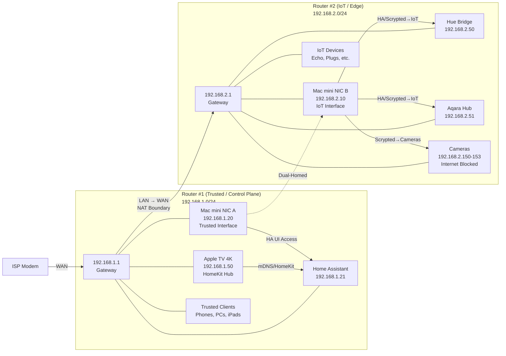

# Phase 1 Network Topology

**Architecture:** Dual-Router Design with Intentional Double NAT

## Network Diagram

## Key Design Elements

- **Dual-Router Architecture**: Two Verizon CR1000A routers in intentional double NAT configuration
- **Router #2 in ROUTER MODE**: WAN port connected to Router #1 LAN (LAN → WAN)
- **Two Subnets**: Trusted (192.168.1.0/24) and IoT (192.168.2.0/24)
- **Mac mini Dual-Homed**: One interface on each router enables HA/Scrypted to reach IoT devices
- **NAT Boundary**: Provides subnet separation but is NOT a security boundary
- **Endpoint Enforcement**: macOS/Windows firewalls provide actual security enforcement
- **HomeKit on Trusted**: All HomeKit hubs stay on Router #1 for mDNS compatibility
- **Camera Isolation**: Cameras on Router #2 with internet access blocked via Access Control

## Traffic Flows

- **HomeKit/mDNS**: Remains within Trusted subnet (Router #1)
- **HA/Scrypted → IoT**: Via Mac mini's IoT interface (192.168.2.10)
- **Trusted → IoT**: Not possible for generic clients (no routing between subnets)
- **Mac mini only**: Can reach both subnets due to dual-homing

---

**Last Updated:** 2026-01-19
